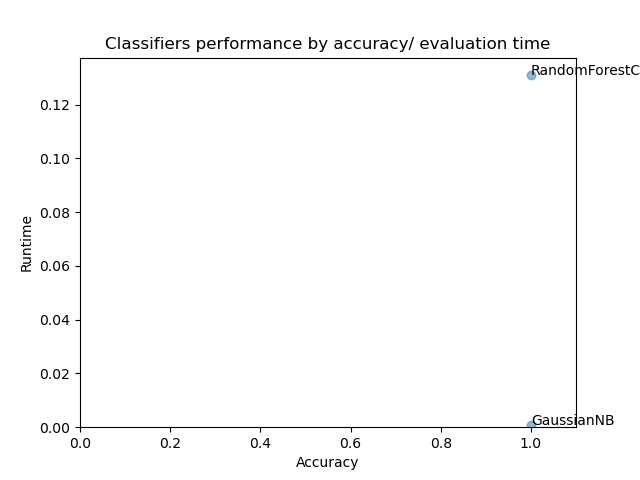

# CourseProject

This is an #UIUC #MCS_DS Text Information Systems course final project.
The developed tool is based on the [technology review](https://github.com/vkreiden/tech_review).

## Table of contents

* [Functionality](#Functionality)
* [Implementation details](#implementation-details)
* [Usage](#usage)
* [Usage presentation](#usage-presentation)

## Functionality
This tool provides a functionality of assessing performance as well as 
performing comparison of supervised learning classifiers when applied to
the log files or chunks of log files for anomalies detection.
It is mostly based on the approach described in [this paper](https://hal.laas.fr/hal-01576291/document).
At high level, the tool receives 2 lists of text files as input - one dataset 
corresponds to the system in error state (e.g. under stress, performance issues, 
security incidents, etc.) and the second set corresponds to a benign work of the system.
Each file represents one data item (document) in one of the two lists thus the dataset 
items are prelabeled with either "fail" or "normal" labels.
After the data is read and preprocessed, an NLP method is applied to transform each data item
(log file) into a vector space. The received matrix along with labels is fed into each of
of the supervised machine learning models to evaluate the performance. The output of the tool run is
a scatter chart displaying each tested classifier over 2 dimensions - classification accuracy 
vs. runtime.
The tool is implemented in python (see [Implementation details](#implementation-details))
and runs using the configuration provided in the [ini format config file](config/config.ini) (see [Usage](#usage)).


## Implementation details
### General
The tool is implemented in python and uses a number of standard python modules for data 
consumption and processing as well as specialized modules for applying NLP, ML methods and
plotting the results as detailed below.

### Reading the configuration
The standard configparser is used to read the following configuration items form the [configuration file](config/config.ini) file:
locations of the two sets of files, preprocessing directives on how to optionally drop the "standard" prefix,
a list of classifiers to assess along with the K-fold test set size parameter. There's also a file format
 parameter which used when plotted into a file.

### Datasets and preprocessing
The expected datasets are two sets of log files (one corresponding to a normal state of the system
and the other one during abnormal work). Each file contains a number of log messages. There are two
preprocessing steps which are performed on the input data using standard string manipulation functions:
1 drop a standard prefix of a log message using delimeters
2 remove non-alphanumerical characters

### NLP
To prepare the data for ML algorithms we start with applying the [*word2vec*](https://en.wikipedia.org/wiki/Word2vec) word embedding to vectorize the words.
We train the *word2vec* model on the vocabulary generated from all the words appearing in the log messages.
We use [*gensim*](https://radimrehurek.com/gensim/) library to build the *word2vec* model over default number of dimensions (100) of the vector space.
To calculate the positions of the files in the vector space we use a centroid approach twice: we first
calculate an average postion vector per log message over all the mesage words vectors. Then we find
a position of each file in the vector space by calculating the average of all the file's log messages vectors.

### ML estimators assessment and comparison
We use [*scikit-learn*](https://scikit-learn.org/) library to build and evaluate ML models. Specifically, we use K-fold validation.
When enumerating a list of the fully-qualified class names of the estimators the reflection is used 
to instantiate an instance of each. We capture accuracy and a model evaluation time measurement for
plotting the results at the next step.

### Results presentation
We use a [*matplotlib*](https://matplotlib.org/) module to plot a scatter chart presenting the results of the run.
X axe shows the classification accuracy vs. model evaluation runtime on the Y axe.
[Usage](#usage) describes two ways of using the tools. When the tool is run on the host
OS the chart will be displayed onto the display. This may not be easily achieved if
the tool is run in the container. In this case the tool will save the chart into 
figures folder in the format specified by user in the config.

### Testing datasets
We provide two sample datasets ["perfect split"](datasets/perfect_split) and ["mix"](datasets/mix).
These datasets are mostly synthetic. They were generated from the real httpd error log files in the
following way: the *notice* level messages are separated into the *"notice"* files while *error* level messages are separated into the *"error"* files. ["Perfect split"](datasets/perfect_split) dataset includes strictly separated *notice* and *error* files while the ["mix"](datasets/mix) contains a ~70%-30% mixes of two kinds. This allows to see the implemented approach works from the perspective of expected accuracy: with the *perfect split* all the classifiers are [100% accurate](figures/perfect_split.png) while when we use a mixed dataset the accuracy drops [below 100%](figures/mix.png).

*Perfect split dataset*

  

*Mix dataset*


## Usage
We prepared and tested two running configurations below.

- Clone this project.

### Docker (recommended)

- Build docker container:
```
docker build -t ad_app .
```

- (On Linux/ Mac) Run:
```
docker run -d --mount type=bind,src="$(pwd)"/config,target=/config \
              --mount type=bind,src="$(pwd)"/datasets,target=/datasets \
              --mount type=bind,src="$(pwd)"/figures,target=/figures ad_app
```

- *__(On Windows)__ substitute "$(pwd)" in the above command with the current directory path*

### Using conda package manager

- Configure:
```
conda update conda
conda install -c anaconda gensim scikit-learn
conda install -c conda-forge matplotlib
conda update -y smart_open
```

- Run:
```
python anomaly_detector.py
```

### Usage presentation
**[recording](https://mediaspace.illinois.edu/media/t/1_qvmekhhz)**
